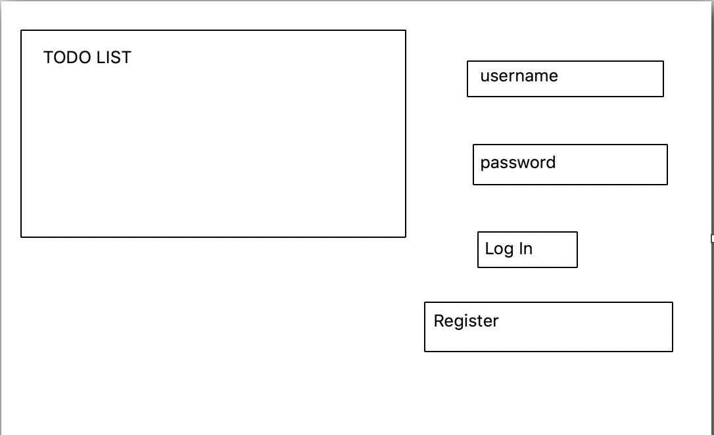
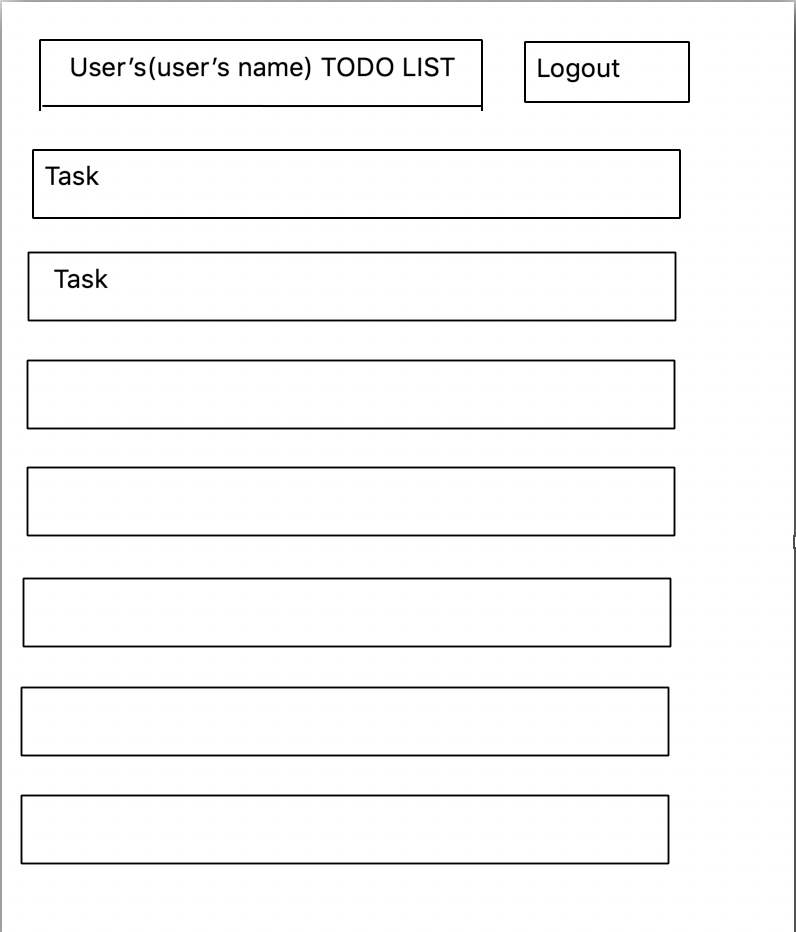
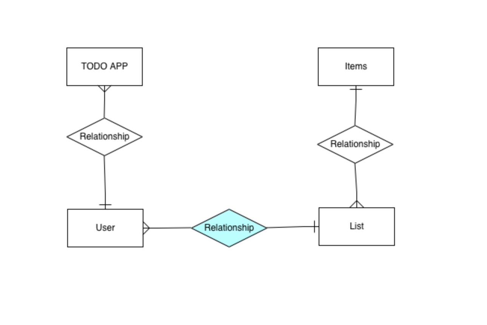

# Concept Design

## Problem Statement

### People tend to forget things that they planned/needed to do as they go through their daily lives.

## Solution

### Create a ***todo list*** that helps track what needs to be done.

---------------------------------------------------------------------------------------------------------------------------

# User Stories

1. As a user, I want a program that helps keep track of what tasks I have left to complete.

2. As a user, I want to be able to be able to identify and prioritise important tasks I have.

3. As a user, I want to be able to tell if/when each task has been completed so I can keep track.

4. As a user, I want to be able to save my task into specific categories so it is easier to sort through what I am looking for.

---------------------------------------------------------------------------------------------------------------------------

# User Flow

1. Check for login.

2. If not logged in, stay at login/register page until user logs in or registers.

3. After logging in, user directed to homepage where all their items on the todo list will be listed.

4. Users can create new post by pressing the create post button.

5. Users can access existing posts by clicking on them.

6. If existing posts are clicked, will redirect them to page with existing post where options to edit/delete/pin post will be provided.

7. If post has been pinned, user will be redirected back to homepage with pinned posts listed first.

---------------------------------------------------------------------------------------------------------------------------

# Wireframing

---------------------------------------------------------------------------------------------------------------------------

# ERD

---------------------------------------------------------------------------------------------------------------------------

